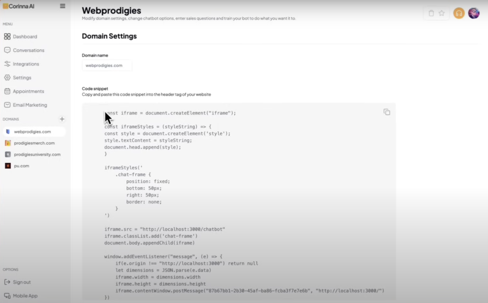
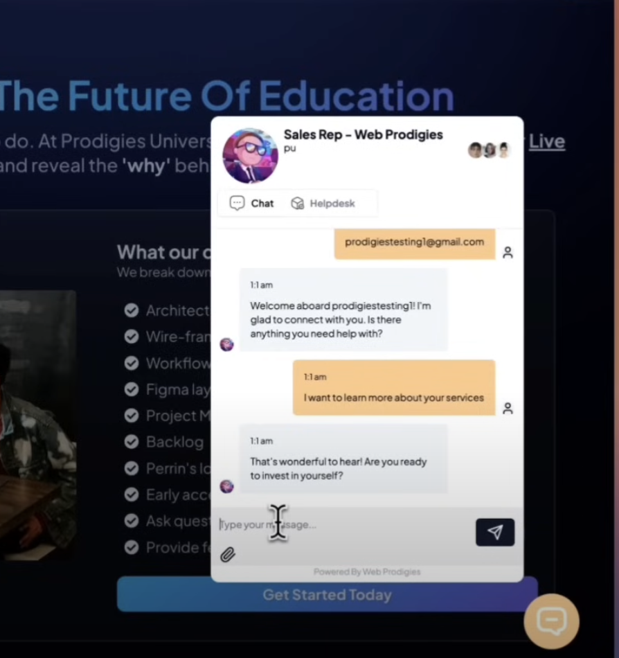

# Hackathon Submission: Corinna AI - MultiChatbot

## GitHub Handles of Team Members  
- [@akshayw1](https://github.com/akshayw1)

## Project Title
**Corinna AI - MultiChatbot**

## Project Description    
Corinna is a comprehensive AI-powered chatbot solution designed for SaaS platforms to enhance customer engagement, streamline communication, and optimize email marketing. Built with a modern tech stack, this chatbot integrates advanced features such as user authentication, real-time communication, file uploads, and secure payment processing, providing a seamless experience for SaaS users. The platform empowers businesses to interact with customers efficiently while managing personalized email marketing campaigns through a robust, customizable interface.

## Inspiration Behind the Project  
The inspiration for Corinna Chatbot emerged from the need for an all-in-one AI assistant that supports SaaS businesses in customer interactions, email marketing, and data management. We aimed to combine essential SaaS functionalities with powerful AI-driven communication to create an easy-to-integrate solution that streamlines user engagement.

## Tech Stack    
Corinna leverages a highly modernized and scalable tech stack to deliver robust functionality and performance:
- **Next.js 15** for an optimized server-client experience.
- **Clerk** for seamless, secure user authentication.
- **Neon Database** for scalable, reliable data storage.
- **Uploadcare** for efficient file management and uploads.
- **Cloudways** for fast, secure hosting and CMS support.
- **Bun** for lightning-fast JavaScript runtime.
- **Stripe** for secure, flexible payment processing.
- **Pusher** for real-time communication capabilities.

### Usage of Appwrite
This project does not utilize Appwrite, opting instead for alternative backend services and tools specifically tailored to SaaS requirements.

## Project Repo  
[GitHub Repository](https://github.com/akshayw1/corinna.ai)

## Demo Video/Photos/Link

